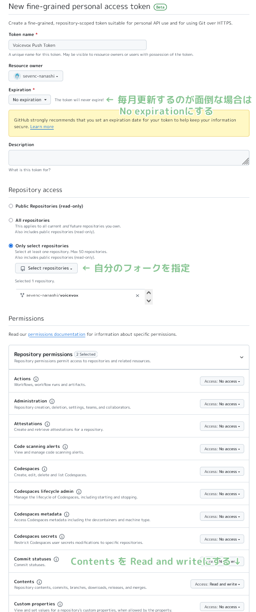

# VOICEVOX

[](https://github.com/VOICEVOX/voicevox/releases)
[](https://github.com/VOICEVOX/voicevox/actions/workflows/build.yml)
[](https://github.com/VOICEVOX/voicevox/actions/workflows/test.yml)
[](https://discord.gg/WMwWetrzuh)

这是 [VOICEVOX](https://voicevox.hiroshiba.jp/) 的编辑器。

（关于引擎请参见 [VOICEVOX ENGINE](https://github.com/VOICEVOX/voicevox_engine/)，
核心请参见 [VOICEVOX CORE](https://github.com/VOICEVOX/voicevox_core/)，
整体构成请参见 [此处](./docs/全体構成.md) 的详细说明。）

## 面向用户

此页面为开发用页面。有关使用方法请参阅 [VOICEVOX 官方网站](https://voicevox.hiroshiba.jp/)。

## 面向有意向项目贡献的开发者

VOICEVOX 项目欢迎有兴趣的人士参与。
我们准备了[说明贡献步骤的指南](./CONTRIBUTING.md)。

虽然提到贡献往往让人想到编程，但还包括文档编写、测试生成、参与改进提案讨论等多种参与方式。
我们也有欢迎新手的任务，期待大家的参与。

VOICEVOX 编辑器使用了 Electron・TypeScript・Vue・Vuex 等技术，整体构成较为复杂。
我们在[代码导览](./docs/コードの歩き方.md)中介绍了其构成，希望能对开发有所帮助。

在创建用于解决 Issue 的 Pull Request 时，为避免与他人同时处理同一个 Issue，
请在 Issue 中告知您已开始着手，或先创建 Draft Pull Request。

欢迎加入 [VOICEVOX 非官方 Discord 服务器](https://discord.gg/WMwWetrzuh) 进行开发讨论和交流。

### 设计指南

请参照 [UX・UI 设计方针](./docs/UX・UIデザインの方針.md)。

## 环境搭建

请安装 [.node-version](.node-version) 中记载版本的 Node.js。
使用 Node.js 版本管理工具（如 [nvs](https://github.com/jasongin/nvs) 或 [Volta](https://volta.sh)）可以轻松安装，并可自动切换 Node.js 版本。

安装 Node.js 后，请 Fork [本仓库](https://github.com/VOICEVOX/voicevox.git) 并执行 `git clone`。

### 安装依赖库

执行以下命令即可安装和更新依赖库：

```bash
npm i -g pnpm # 仅首次
pnpm i
```

### AI 代理的设置（可选）

执行以下命令可设置 Codex CLI 和 Claude Code 等 AI 代理所需的文件：

```bash
pnpm run setup-agents
```

## 运行

### 引擎准备

复制 `.env.production` 并创建 `.env`，将 `VITE_DEFAULT_ENGINE_INFOS` 中的 `executionFilePath` 指定为
[产品版 VOICEVOX](https://voicevox.hiroshiba.jp/) 中的 `vv-engine/run.exe` 即可运行。

在 Windows 上未更改安装路径的情况下，请指定 `%LOCALAPPDATA%/Programs/VOICEVOX/vv-engine/run.exe`。
注意路径分隔符请使用 `/` 而非 `\`。

如果使用面向 macOS 的 `VOICEVOX.app`，请指定 `/path/to/VOICEVOX.app/Contents/Resources/vv-engine/run`。

在 Linux 上，请指定从 [Releases](https://github.com/VOICEVOX/voicevox/releases/) 获取的 tar.gz 版中包含的 `vv-engine/run` 命令。
对于 AppImage 版，可通过 `$ /path/to/VOICEVOX.AppImage --appimage-mount` 挂载文件系统。

如果独立启动了引擎 API 服务器而不运行 VOICEVOX 编辑器，则无需指定 `executionFilePath`，
但请将 `executionEnabled` 设为 `false`。
这也适用于正在运行产品版 VOICEVOX 的情况。

如需更改引擎 API 的目标端点，请修改 `VITE_DEFAULT_ENGINE_INFOS` 中的 `host`。

### 运行 Electron

```bash
# 在易于开发的环境中运行
pnpm run electron:serve

# 在接近构建环境的环境中运行
pnpm run electron:serve --mode production

# 带参数运行
pnpm run electron:serve -- ...
```

语音合成引擎的仓库在这里：<https://github.com/VOICEVOX/voicevox_engine>

### 运行 Storybook

可以使用 Storybook 来开发组件。

```bash
pnpm run storybook
```

main 分支的 Storybook 可从 [VOICEVOX/preview-pages](https://github.com/VOICEVOX/preview-pages) 确认。
<https://voicevox.github.io/preview-pages/preview/editor/branch-main/storybook/index.html>

### 运行浏览器版（开发中）

请另行启动语音合成引擎，然后执行以下命令并访问显示的 localhost 地址：

```bash
pnpm run browser:serve
```

此外，main 分支的构建结果已部署到 [VOICEVOX/preview-pages](https://github.com/VOICEVOX/preview-pages)。
<https://voicevox.github.io/preview-pages/preview/editor/branch-main/editor/index.html>
目前需要在本地 PC 上启动语音合成引擎。

## 构建

```bash
pnpm run electron:build
```

### 在 Github Actions 中构建

在 fork 的仓库中启用 Actions，通过 workflow_dispatch 触发 `build.yml` 即可构建。
成果物会上传到 Release。

## 测试

### 单元测试

执行 `./tests/unit/` 下的测试以及 Storybook 的测试。

```bash
pnpm run test:unit
pnpm run test-watch:unit # 监视模式
pnpm run test-ui:unit # 显示 Vitest UI
pnpm run test:unit --update # 更新快照
```

> [!NOTE]  
> `./tests/unit` 下的测试会根据文件名改变测试执行环境。
>
> - `.node.spec.ts`：Node.js 环境
> - `.browser.spec.ts`：浏览器环境（Chromium）
> - `.spec.ts`：浏览器环境（使用 happy-dom 模拟）

### 浏览器端到端测试

执行不需要 Electron 功能的 UI 和语音合成等端到端测试。

> [!NOTE]
> 部分修改引擎设置的测试仅在 CI（Github Actions）上执行。

```bash
pnpm run test:browser-e2e
pnpm run test-watch:browser-e2e # 监视模式
pnpm run test-watch:browser-e2e --headed # 显示测试中的 UI
pnpm run test-ui:browser-e2e # 显示 Playwright UI
```

由于使用 Playwright，也可以生成测试模式。
**请在浏览器版启动状态下**执行以下命令：

```bash
pnpm exec playwright codegen http://localhost:5173/ --viewport-size=1024,630
```

详情请参照 [Playwright 文档的 Test generator](https://playwright.dev/docs/codegen-intro)。

### Storybook 的视觉回归测试

比较 Storybook 组件的屏幕截图，若有变更则显示差异。

> [!NOTE]
> 此测试仅可在 Windows 上运行。

```bash
pnpm run test:storybook-vrt
pnpm run test-watch:storybook-vrt # 监视模式
pnpm run test-ui:storybook-vrt # 显示 Playwright UI
```

#### 更新屏幕截图

浏览器端到端测试和 Storybook 都进行视觉回归测试。
目前 VRT 测试仅在 Windows 上进行。
可通过以下步骤更新屏幕截图：

##### 在 Github Actions 中更新

1. 在 fork 的仓库设置中启用 GitHub Actions。
2. 在仓库设置的 Actions > General > Workflow permissions 中选择 Read and write permissions。
3. 从 GitHub 的 Actions 标签页选择“Test”工作流，点击“Run workflow”。
4. 选择要更新的分支，勾选“更新快照”后执行。

   也可使用 gh 命令执行：

   ```bash
   gh workflow run test.yml -R (用户名)/voicevox --ref (分支名) -f update_snapshots=true
   ```

5. Github Workflow 完成后，更新的屏幕截图会被提交。
6. Pull 之后，推送空提交以重新运行测试：

   ```bash
   git commit --allow-empty -m "（重新运行测试）"
   git push
   ```

> [!NOTE]
> 通过创建 Token 并添加到 Secrets，可以自动重新运行测试。
>
> 1. 访问 [Fine-granted Tokens](https://github.com/settings/personal-access-tokens/new)。
> 2. 输入适当名称，授予对 `用户名/voicevox` 的访问权限，并在 Repository permissions 的 Contents 中选择 Read and write。
>    <details>
>    <summary>设置示例</summary>
>    
>    </details>
> 3. 创建 Token 并复制字符串。
> 4. 打开 `用户名/voicevox` 仓库的 Settings > Secrets and variables > Actions > New repository secret。
> 5. 在名称中输入 `PUSH_TOKEN`，粘贴刚才的字符串并添加 Secret。

##### 在本地更新

仅更新与本地 PC 操作系统对应的部分。

```bash
pnpm run test:browser-e2e --update-snapshots
```

### Electron 端到端测试

执行需要 Electron 功能、包含引擎启动/停止等的端到端测试。

```bash
pnpm run test:electron-e2e
pnpm run test-watch:electron-e2e # 监视模式
```

## 生成依赖库的许可证信息

依赖库的许可证信息在 Github Workflow 构建时自动生成。也可通过以下命令生成：

```bash
# 从 voicevox_engine 获取 licenses.json 作为 engine_licenses.json

pnpm run license:generate -o voicevox_licenses.json
pnpm run license:merge -o public/licenses.json -i engine_licenses.json -i voicevox_licenses.json
```

## 代码格式化

整理代码格式。请在提交 Pull Request 前执行。

```bash
pnpm run fmt
```

## Lint（静态分析）

对代码进行静态分析，防患于未然。请在提交 Pull Request 前执行。

```bash
pnpm run lint
```

执行 lint 后会在仓库根目录生成缓存文件 `.eslintcache`。
若 ESLint 升级、配置变更或缓存损坏，请删除此文件。

## 拼写检查

使用 [typos](https://github.com/crate-ci/typos) 进行拼写检查。

```bash
pnpm run typos
```

可执行拼写检查。
若有误判或需要排除的文件，请按照[配置文件说明](https://github.com/crate-ci/typos#false-positives)编辑 `_typos.toml`。

## 类型检查

执行 TypeScript 类型检查。

```bash
pnpm run typecheck
```

## Markdownlint

执行 Markdown 语法检查。

```bash
pnpm run markdownlint
```

## Shellcheck

执行 ShellScript 语法检查。
安装方法请参照 [此处](https://github.com/koalaman/shellcheck#installing)。

```bash
shellcheck ./build/*.sh
shellcheck ./tools/*.bash
```

## GitHub Actions 版本固定

使用 [pinact](https://github.com/suzuki-shunsuke/pinact) 将 GitHub Actions 版本固定为完整长度提交 SHA。

```bash
# 固定版本
pinact run

# 更新并固定版本
pinact run --update --min-age 7
```

## OpenAPI generator

请在[开发版 VOICEVOX ENGINE](https://github.com/voicevox/voicevox_engine) 启动的状态下执行以下命令：

```bash
pnpm run generate-openapi
```

### OpenAPI generator 版本升级

可通过以下命令确认和安装新版本：

```bash
pnpm exec openapi-generator-cli version-manager list
```

## 在 VS Code 中调试运行

在 npm scripts 的 `serve` 或 `electron:serve` 等开发构建下，由于构建所使用的 vite 会输出 sourcemap，因此源代码与输出代码之间会建立映射。

复制 `.vscode/launch.template.json` 创建 `.vscode/launch.json`，
复制 `.vscode/tasks.template.json` 创建 `.vscode/tasks.json`，
即可启用从 VS Code 运行开发构建并进行调试的任务。

## 许可证

采用 LGPL v3 与不需要公开源代码的另类许可证的双重许可。
如需获取另类许可证，请联系ヒホ。
X 账号：[@hiho_karuta](https://x.com/hiho_karuta)
Bilibili 汉化者账号：[WERTYUS11](https://space.bilibili.com/1177535270)
