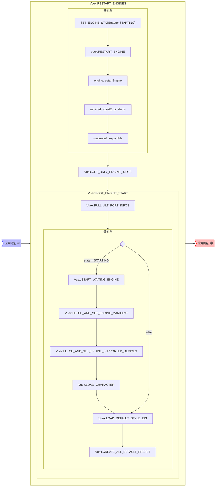

# 引擎重启时序图

```mermaid
flowchart LR
  349670>"应用运行中"] --> 675170["Vuex.RESTART_ENGINES"]
  style 349670 fill:#bbbbff,stroke:#0000ff
  675170 --> 929642>"应用运行中"]
  style 929642 fill:#ffbbbb,stroke:#ff0000
  subgraph 675170["Vuex.RESTART_ENGINES"]
    408243["各引擎"] --> 927120["Vuex.GET_ONLY_ENGINE_INFOS"]
    927120 --> 512074["Vuex.POST_ENGINE_START"]
    subgraph 408243["各引擎"]
      262932["SET_ENGINE_STATE(state=STARTING)"] --> 595264["back.RESTART_ENGINE"]
      595264 --> 920995["engine.restartEngine"]
      920995 --> 939785["runtimeInfo.setEngineInfos"]
      939785 --> 494722["runtimeInfo.exportFile"]
    end
    subgraph 512074["Vuex.POST_ENGINE_START"]
      623200["Vuex.PULL_ALT_PORT_INFOS"] --> 225947["各引擎"]
      subgraph 225947["各引擎"]
        489573{" "} -->|"state==STARTING"| 445649["Vuex.START_WAITING_ENGINE"]
        445649 --> 722638["Vuex.FETCH_AND_SET_ENGINE_MANIFEST"]
        722638 --> 520207["Vuex.FETCH_AND_SET_ENGINE_SUPPORTED_DEVICES"]
        520207 --> 526075["Vuex.LOAD_CHARACTER"]
        526075 --> 752392["Vuex.LOAD_DEFAULT_STYLE_IDS"]
        489573 -->|"else"| 752392
        752392 --> 738989["Vuex.CREATE_ALL_DEFAULT_PRESET"]
      end
    end
  end
```
