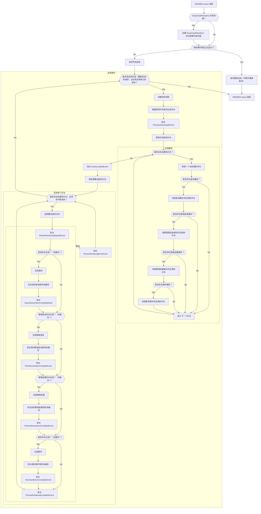

# 歌曲渲染流程图

```mermaid
graph TD
    RenderCall["RENDER action 调用"]
    RenderCall --> RendererMissing{{"SongTrackRenderer 尚未创建？"}}
    RendererMissing -- Yes --> CreateRenderer["创建 SongTrackRenderer 并注册事件监听器"]
    RendererMissing -- No --> LoopRunning{{"渲染循环是否正在运行？"}}
    CreateRenderer --> LoopRunning
    LoopRunning -- Yes --> ReRenderRequest["请求重新渲染（中断并重新启动）"]
    ReRenderRequest --> RenderEnd["RENDER action 结束"]
    LoopRunning -- No --> StartRenderRequest["请求开始渲染"]
    StartRenderRequest --> CanStart{{"是否有渲染开始（重新启动）的请求，且没有渲染停止的请求？"}}
    CanStart -- No --> RenderEnd

    subgraph RenderingLoop["渲染循环"]
        CanStart -- Yes --> TakeSnapshot["创建项目快照"]
        TakeSnapshot --> GeneratePhrases["根据快照中的音符生成乐句"]
        GeneratePhrases --> PhrasesGeneratedEvent["发出 PhrasesGeneratedEvent"]
        PhrasesGeneratedEvent --> FilterRenderablePhrases["提取可渲染的乐句"]
        FilterRenderablePhrases --> HasUnprocessedPhrases{{"是否有未处理的乐句？"}}

        subgraph LoadCache["应用缓存"]
            HasUnprocessedPhrases -- Yes --> GetUnprocessedPhrase["获取一个未处理的乐句"]
            GetUnprocessedPhrase --> HasQueryCache{{"是否存在查询缓存？"}}
            HasQueryCache -- No --> NextPhrase["进入下一个乐句"]
            HasQueryCache -- Yes --> LoadQueryCache["读取查询缓存并应用到乐句"]

            LoadQueryCache --> HasPitchCache{{"是否存在歌唱音高缓存？"}}
            HasPitchCache -- No --> NextPhrase
            HasPitchCache -- Yes --> LoadPitchCache["读取歌唱音高缓存并应用到乐句"]

            LoadPitchCache --> HasVolumeCache{{"是否存在歌唱音量缓存？"}}
            HasVolumeCache -- No --> NextPhrase
            HasVolumeCache -- Yes --> LoadVolumeCache["读取歌唱音量缓存并应用到乐句"]

            LoadVolumeCache --> HasVoiceCache{{"是否存在歌声缓存？"}}
            HasVoiceCache -- No --> NextPhrase
            HasVoiceCache -- Yes --> LoadVoiceCache["读取歌声缓存并应用到乐句"]

            LoadVoiceCache --> NextPhrase
            NextPhrase --> HasUnprocessedPhrases
        end

        HasUnprocessedPhrases -- No --> CacheLoadedEvent["发出 CacheLoadedEvent"]
        CacheLoadedEvent --> FilterPhrasesRequiringRender["提取需要渲染的乐句"]
        FilterPhrasesRequiringRender --> CanRender{{"是否有未处理的乐句，且没有中断请求？"}}

        subgraph RenderPhrases["渲染每个乐句"]
            CanRender -- Yes --> SelectPhrase["选择要渲染的乐句"]
            SelectPhrase --> PhraseRenderingStartedEvent["发出 PhraseRenderingStartedEvent"]

            subgraph RenderPhrase[" "]
                PhraseRenderingStartedEvent --> QueryNotGenerated{{"查询尚未生成？（无缓存？）"}}
                QueryNotGenerated -- Yes --> GenerateQuery["生成查询"]
                GenerateQuery --> CacheGeneratedQuery["将生成的查询保存到缓存"]
                QueryNotGenerated -- No --> PitchNotGenerated{{"歌唱音高尚未生成？（无缓存？）"}}

                CacheGeneratedQuery --> QueryGenerationCompleteEvent["发出 QueryGenerationCompleteEvent"]
                QueryGenerationCompleteEvent --> PitchNotGenerated

                PitchNotGenerated -- Yes --> GeneratePitch["生成歌唱音高"]
                GeneratePitch --> CacheGeneratedPitch["将生成的歌唱音高保存到缓存"]
                PitchNotGenerated -- No --> VolumeNotGenerated{{"歌唱音量尚未生成？（无缓存？）"}}

                CacheGeneratedPitch --> PitchGenerationCompleteEvent["发出 PitchGenerationCompleteEvent"]
                PitchGenerationCompleteEvent --> VolumeNotGenerated

                VolumeNotGenerated -- Yes --> GenerateVolume["生成歌唱音量"]
                GenerateVolume --> CacheGeneratedVolume["将生成的歌唱音量保存到缓存"]
                VolumeNotGenerated -- No --> VoiceNotGenerated{{"歌声尚未生成？（无缓存？）"}}

                CacheGeneratedVolume --> VolumeGenerationCompleteEvent["发出 VolumeGenerationCompleteEvent"]
                VolumeGenerationCompleteEvent --> VoiceNotGenerated

                VoiceNotGenerated -- Yes --> SynthesizeVoice["合成歌声"]
                SynthesizeVoice --> CacheSynthesizedVoice["将合成的歌声保存到缓存"]
                VoiceNotGenerated -- No --> PhraseRenderingCompleteEvent["发出 PhraseRenderingCompleteEvent"]

                CacheSynthesizedVoice --> VoiceSynthesisCompleteEvent["发出 VoiceSynthesisCompleteEvent"]
                VoiceSynthesisCompleteEvent --> PhraseRenderingCompleteEvent
            end

            PhraseRenderingErrorEvent["发出 PhraseRenderingErrorEvent"]
            PhraseRenderingCompleteEvent --> CanRender
            PhraseRenderingErrorEvent --> CanRender
            RenderPhrase -- 错误 --> PhraseRenderingErrorEvent
        end

        CanRender -- No --> CanStart
    end
```
