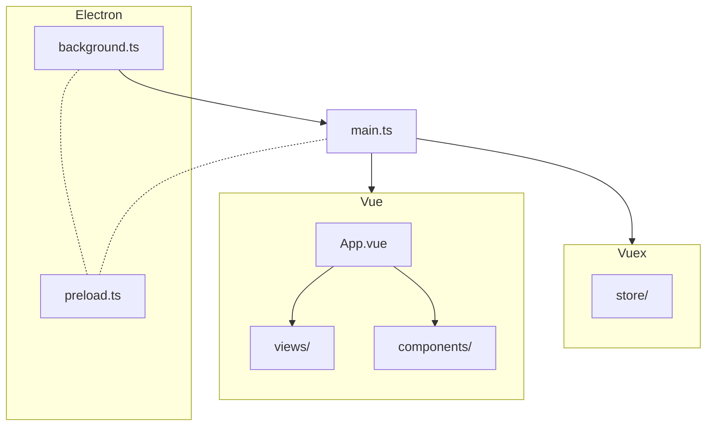
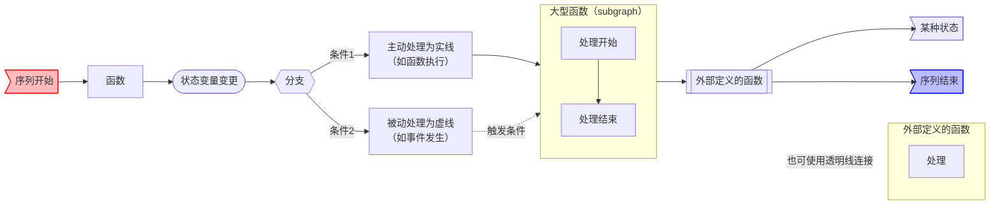

 ```
# VOICEVOX 编辑器代码导览

VOICEVOX 编辑器采用了 Electron、TypeScript、Vue、Vuex 等技术，其整体架构可能不太容易理解。
本文将介绍其构成。希望能为阅读代码提供参考。

## 代码执行顺序

针对希望直接阅读代码的读者，这里简要说明代码的执行顺序。请注意，为了便于理解，部分表述可能不够精确。

1.  Electron 启动应用程序。此时执行的代码是 `src/backend/electron/main.ts`。
2.  `src/backend/electron/main.ts` 启动用于显示 UI 的窗口。此时执行的代码是 `src/main.ts`。
3.  `main.ts` 使用 Vue 渲染 UI。UI 的根组件是 `src/App.vue`。
4.  `src/App.vue` 调用各种 UI。各个 UI 组件位于 `src/views` 和 `src/components` 中。
5.  在 UI 渲染的同时，管理应用程序状态和逻辑的 Vuex store 会被初始化。Vuex 相关的代码位于 `src/store` 目录中。
6.  所有这些代码都使用 TypeScript 编写。Vue 和 TypeScript 代码在执行或构建时会自动转译为 JavaScript。

此外，Electron 为了在首次启动的进程（主进程）和 UI 窗口进程（渲染器进程）之间进行通信，会从两者加载预加载脚本 `src/backend/electron/preload.ts`。



## 设计

这里将简要介绍后端、Vuex 和 UI 相关的设计方针。

### 什么是后端

后端是指处理无法在 Web 浏览器（包括 Electron 的渲染器进程）中完成的任务的部分。
例如，以下任务由后端完成：

-   语音合成引擎的启动与停止
-   文件的读写
-   设置的读写

目前，存在以下后端：

-   **Electron** (`src/backend/electron/`)
    -   产品版中使用此后端。
    -   所有后端都是基于其接口构建的。
-   **浏览器** (`src/backend/browser/`)
    -   测试中使用此后端。
    -   在 DevContainer 或 WSL 等难以使用 Electron 的环境下也可使用。
    -   利用 Web API 模拟 Electron 的功能。
    -   例如，部分功能（如语音合成引擎的启动与停止）尚未实现。

可以通过 `window.backend` 访问后端，但建议通过 Vuex 的 store 进行访问，而不是直接访问。
详情请参阅 Vuex 部分。

### Electron 相关（`src/backend/electron/`）

VOICEVOX 产品版使用 Electron 实现后端。
Electron 后端的主要组成部分如下：

-   `main.ts`：作为 Electron 主进程启动的入口点。负责应用程序生命周期管理和窗口创建等。
-   **IPC 相关**（`ipc.ts`, `ipcMainHandle.ts` 等）：负责主进程和渲染器进程之间的通信。接收渲染器进程的请求，并调用相应的功能。
-   **各功能模块**（`engineAndVvppController.ts`、`manager/` 目录下等）：实现语音合成引擎管理等具体功能。
-   `renderer/`：包含渲染器进程侧调用后端功能的代码。

这些模块协同工作，实现了 Electron 环境下的后端处理。

此外，为了使 `DisplayableError` 在经过 Electron 的 IPC 通信（主进程与 preload 之间，preload 与 mainWorld 之间）后仍能作为 `DisplayableError` 处理，定义了 `TransferableResult` 类型，并将其包装后进行 IPC 通信。

### Vuex 相关（`src/store/`）

在 VOICEVOX 中，动态变化的状态和修改状态的函数通过 Vuex 的 `Store` 进行管理。
`Store` 根据语音、引擎、UI 等各自的目的进行划分，并在 `src/store/index.ts` 中进行整合。

简要说明 Vuex 的规范。
状态保存在 `State` 中，状态的修改通过 `Mutation` 进行。
`Mutation` 必须同步执行，如果需要进行异步处理，则使用 `Action`。
在 VOICEVOX 中，从 UI 执行的操作会通过 `Action`，然后由 `Action` 执行 `Mutation`。
这是为了实现后续将介绍的撤销/重做（Undo/Redo）机制而进行的设计。

Vuex 的类型支持不足，因此 VOICEVOX 独立创建了类型相关的机制（`src/store/type.ts`）。
如果想定义函数，首先在 `type.ts` 中声明类型，然后在对应的 `Store` 中实现。

当 UI 需要访问后端或引擎时，必须通过 Vuex 进行。
这继承了 Vuex 的原始思想 Flux，旨在尽可能地集中管理因外部访问而产生的意外状态变化。

VOICEVOX 通过包装 Vuex 的 `Mutation` 来实现撤销/重做（Undo/Redo）机制。
当状态从 A 变为 B 时，反向的 B→A 变化会自动推入撤销（Undo）栈。
详情请参阅 [实现撤销/重做 #116](https://github.com/VOICEVOX/voicevox/issues/116)。

### UI 相关（`src/components/`）

TODO

## 源代码目录结构

-   `src/`
    -   `backend/`：存放后端代码的目录。
        -   `electron/`：存放 Electron 版后端代码的目录。
        -   `browser/`：存放浏览器版后端代码的目录。
        -   `common/`：存放 Electron 和浏览器共用后端代码的目录。
    -   `main.ts`：首次执行以显示窗口的代码。在此处集成 Vue 和 Vuex。
    -   `App.vue`：Vue 的根组件。所有其他组件的父组件。
    -   `components/`：存放构成 UI 部分的 Vue 组件的目录。
        -   关于 UI 名称与 Vue 文件名的具体对应关系，请参阅 [UI 名称与 Vue 文件名对照表](UI名称とVueファイル名の対応早見表.md)。
    -   `store/`：Vuex store 的目录。应用程序的大部分逻辑都写在这里。
    -   `type/`：存放 TypeScript 类型定义的目录。
    -   `composables/`：存放 Vue composables 的目录。
    -   `domain/`：存放领域逻辑和实用函数的目录。
    -   `styles/`：存放 CSS 和 SCSS 的目录。
    -   `infrastructures/`：当需要一个中间层来连接 UI 代码和非 UI 代码时，用于存放相关代码的目录。
    -   `plugins/`：存放 Vue 插件的目录。
    -   `sing/`：存放歌曲相关代码的目录。
    -   `openapi/`：存放用于调用引擎 API 的代码的目录。由 OpenAPI 自动生成。
    -   `helpers/`：存放实用函数的目录。
-   `public/`：存放应用程序资源文件的目录。
-   `build/`：存放构建所需文件的目录。
-   `tests/`
    -   `e2e/`：存放端到端（End to End）测试代码的目录。
        -   `browser/`：存放浏览器版端到端测试代码的目录。
        -   `electron/`：存放 Electron 版端到端测试代码的目录。
        -   `storybook/`：存放 Storybook VRT（视觉回归测试）代码的目录。
            -   尽管测试本身不是端到端测试，但由于使用了 Storybook，因此将其放在 `e2e` 目录中。
    -   `unit/`：存放单元测试代码的目录。
    -   `env/`：存放测试用环境变量文件的目录。
-   `tools/`：存放开发工具和脚本的目录。
-   `vendored/`
    -   存放下载的库和工具的目录。
    -   在 `pnpm install` 时会自动下载。

## 时序图

-   [启动时序图](res/起動シーケンス図.md)
-   [关闭时序图](res/終了シーケンス図.md)
-   [引擎重启时序图](res/エンジン再起動シーケンス図.md)

这些图表使用 [Mermaid Flow](https://www.mermaidflow.app/) 绘制。将 Mermaid 代码粘贴到该网站即可重新编辑。描述规则如下：



处理前缀列表：

-   `back`: `backend/electron/main.ts` 中的函数
-   `app`: app 事件
-   `win`: win 事件
-   `engine`: `EngineManager` 的方法
-   `store`: `electron-store` 的方法
-   `Vuex`: Vuex 函数
```

