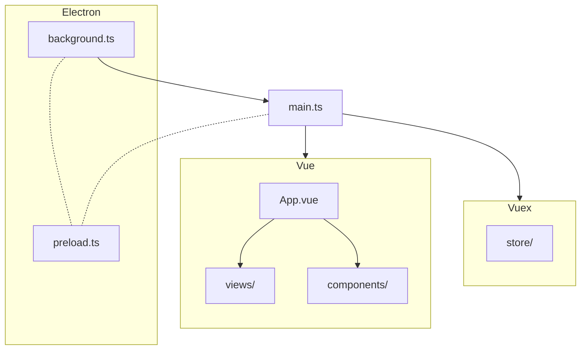
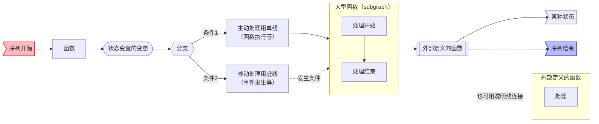

# VOICEVOX 编辑器代码导览

VOICEVOX 编辑器使用了 Electron・TypeScript・Vue・Vuex 等技术，整体构成较为复杂。
这里将介绍其构成方式。希望能对您阅读代码有所帮助。

## 代码执行顺序

为方便想直接阅读代码的读者，这里简要说明代码的执行顺序。请注意，为优先保证易懂性，部分表述可能不够精确。

1. electron 启动应用程序。此时执行的代码是 `src/backend/electron/main.ts`。
2. 从 `src/backend/electron/main.ts` 启动用于 UI 显示的窗口。此时执行的代码是 `src/main.ts`。
3. `main.ts` 使用 Vue 渲染 UI。UI 的根组件是 `src/App.vue`。
4. `src/App.vue` 调用各种 UI。各 UI 分别位于 `src/views` 和 `src/components` 中。
5. 在 UI 渲染的同时，管理应用状态和逻辑的 Vuex store 被初始化。Vuex 相关代码位于 `src/store` 目录。
6. 这些代码全部使用 TypeScript 编写。Vue 和 TypeScript 代码在执行/构建时会自动转译为 JavaScript。

此外，electron 为了在首先启动的进程（主进程）和 UI 窗口进程（渲染进程）之间通信，会从两侧加载预加载脚本 `src/backend/electron/preload.ts`。

```mermaid
flowchart TB
subgraph Electron
    direction TB
    background.ts -.- preload.ts
end
background.ts --> main.ts

main.ts -.- preload.ts
main.ts --> Vue & Vuex

subgraph Vuex
    direction TB
    store/
end

subgraph Vue
    direction TB
    App.vue --> views/ & components/
end
```

## 设计

这里简要介绍后端、Vuex 和 UI 方面的设计方针。

### 什么是后端

后端是指无法仅在 Web 浏览器（包括 Electron 的渲染进程）中完成、需要额外处理的部分。
例如，后端负责以下处理：

- 语音合成引擎的启动和停止
- 文件的读写
- 设置的读写

目前存在以下后端：

- Electron（`src/backend/electron/`）
  - 在正式版中使用。
  - 所有后端均以此接口为基础构建。
- 浏览器（`src/backend/browser/`）
  - 在测试中使用。
  - 也适用于 DevContainer 内或 WSL 内等难以使用 Electron 的环境。
  - 使用 Web API 再现 Electron 的功能。
  - 部分功能（如语音合成引擎的启动和停止）尚未实现。

后端可通过 `window.backend` 访问，但建议不直接访问，而是通过 Vuex store 进行访问。
详情请参阅 Vuex 章节。

### Electron 相关（`src/backend/electron/`）

在正式版 VOICEVOX 中，使用 Electron 实现后端。
Electron 后端的主要组成部分如下：

- `main.ts`：作为 Electron 主进程启动的入口点。负责应用的生命周期管理和窗口创建等。
- IPC 相关（`ipc.ts`、`ipcMainHandle.ts` 等）：负责主进程与渲染进程之间的通信。接收来自渲染进程的请求，并调用相应的功能。
- 各功能模块（`engineAndVvppController.ts`、`manager/` 下等）：实现语音合成引擎管理等具体功能。
- `renderer/`：包含从渲染进程侧使用后端功能的代码。

这些模块相互协作，在 Electron 环境中实现后端处理。

此外，为了即使在 Electron 的 IPC 通信（主进程与 preload 之间、preload 与 mainWorld 之间）过程中也能将 DisplayableError 作为 DisplayableError 处理，我们定义了 `TransferableResult` 类型，并先将其包裹后再进行 IPC 通信。

### Vuex 相关（`src/store/`）

在 VOICEVOX 中，通过 Vuex 的 `Store` 管理动态变化的状态以及修改状态的函数。
`Store` 根据语音、引擎、UI 等不同用途进行分割，并在 `src/store/index.ts` 中整合。

简要说明 Vuex 的规格。
状态保存在 `State` 中，状态的变更通过 `Mutation` 进行。
`Mutation` 需要同步执行，但若要进行异步处理，则使用 `Action`。
在 VOICEVOX 中，从 UI 执行的操作都通过 `Action` 进行，并在 `Action` 内部调用 `Mutation`。
这是为了后续介绍的 Undo/Redo 机制而设计的。

由于 Vuex 的类型支持不够完善，VOICEVOX 自行构建了类型相关机制（`src/store/type.ts`）。
若要定义函数，首先在 `type.ts` 中声明类型，然后在相应的 `Store` 中实现。

当 UI 需要访问后端或引擎时，必须通过 Vuex 进行。
这沿袭了 Vuex 原本的 Flux 思想，目的是尽可能集中管理因外部访问而产生的意外状态变化等。

VOICEVOX 通过封装 Vuex 的 `Mutation` 来实现 Undo/Redo 机制。
当状态从 A 变为 B 时，其反向操作（B→A 的变更）会自动被压入 Undo 栈。
详情请参阅 [想要实现 Undo/Redo #116](https://github.com/VOICEVOX/voicevox/issues/116)。

### UI 相关（`src/components/`）

待补充

## 源代码目录结构

- `src/`
  - `backend/`：存放后端代码的目录。
    - `electron/`：存放 Electron 版后端代码的目录。
    - `browser/`：存放浏览器版后端代码的目录。
    - `common/`：存放 Electron 和浏览器共用后端代码的目录。
  - `main.ts`：为显示窗口而最先执行的代码。在此处整合 Vue 和 Vuex。
  - `App.vue`：Vue 的根组件。所有其他组件的父组件。
  - `components/`：作为 UI 组件的 Vue 组件目录。
    - 关于具体对应哪个 UI，请参照 [UI名称与Vue文件对应速查表](UI名称とVueファイル名の対応早見表.md)。
  - `store/`：Vuex store 目录。应用的大部分逻辑写在这里。
  - `type/`：存放 TypeScript 类型定义等的目录。
  - `composables/`：存放 Vue 组合式函数的目录。
  - `domain/`：存放领域逻辑和实用函数的目录。
  - `styles/`：存放 CSS 和 SCSS 等的目录。
  - `infrastructures/`：用于在 UI 代码与非 UI 代码之间搭建中间层的代码目录。
  - `plugins/`：存放 Vue 插件的目录。
  - `sing/`：存放歌唱相关代码的目录。
  - `openapi/`：用于调用引擎 API 的代码目录。通过 OpenAPI 自动生成。
  - `helpers/`：存放实用函数的目录。
- `public/`：存放应用资源文件的目录。
- `build/`：存放构建所需文件的目录。
- `tests/`
  - `e2e/`：存放端到端测试代码的目录。
    - `browser/`：存放浏览器版端到端测试代码的目录。
    - `electron/`：存放 Electron 版端到端测试代码的目录。
    - `storybook/`：存放 Storybook VRT（视觉回归测试）测试代码的目录。
      - 测试本身并非端到端测试，但由于使用了 Storybook，因此放在 `e2e` 目录下。
  - `unit/`：存放单元测试代码的目录。
  - `env/`：存放测试用环境变量文件的目录。
- `tools/`：存放开发用工具和脚本的目录。
- `vendored/`
  - 存放已下载的库和工具的目录。
  - 在 `pnpm install` 时会自动下载。

## 时序图

- [启动时序图](res/起動シーケンス図.md)
- [关闭时序图](res/終了シーケンス図.md)
- [引擎重启时序图](res/エンジン再起動シーケンス図.md)

使用 [Mermaid Flow](https://www.mermaidflow.app/) 绘制。将 mermaid 代码粘贴到网站上即可重新编辑。书写规则请参照下方。

```mermaid
flowchart LR
  817736>"序列开始"] --> 584587["函数"]
  style 817736 fill:#ffbbbb,stroke:#ff0000
  584587 --> 965553(["状态变量的变更"])
  965553 --> 945949{{"分支"}}
  945949 -->|"条件1"| 366994["主动处理用单线\n（函数执行等）"]
  945949 -->|"条件2"| 871294["被动处理用虚线\n（事件发生等）"]
  366994 --> 617606["大型函数（subgraph）"]
  871294 -.->|"发生条件"| 617606
  572391[["外部定义的函数"]] --> 314405>"某种状态"]
  572391 --> 230853>"序列结束"]
  style 230853 fill:#bbbbff,stroke:#0000ff
  617606 --> 572391
  572391 ~~~|"也可用透明线连接"| 513532["外部定义的函数"]
  subgraph 617606["大型函数（subgraph）"]
    776462["处理开始"] --> 992786["处理结束"]
  end
  subgraph 513532["外部定义的函数"]
    327013["处理"]
  end
```

处理前缀列表

- back: backend/electron/main.ts 中的函数
- app: app 的事件
- win: win 的事件
- engine: EngineManager 的方法
- store: electron-store 的方法
- Vuex: Vuex 的函数
