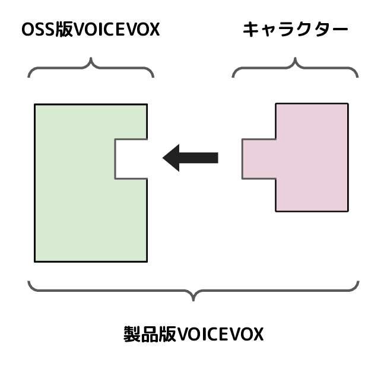

# 关于整体构成

## OSS 版与产品版的区别

这里介绍以开源形式公开的 VOICEVOX（OSS 版 VOICEVOX）与在[官网](https://voicevox.hiroshiba.jp/)上作为产品公开的 VOICEVOX（产品版 VOICEVOX）之间的区别。

简而言之，区别在于是否包含角色。
角色大多采用与 OSS 不相容的许可证，因此无法将其开源。
例如，角色许可证中常见的“禁止违背公序良俗的使用”和“排除反社会势力”等条款，与开源定义之一的“禁止对使用领域进行歧视”相冲突。

[The Open Source Definition](https://opensource.org/osd)

因此，VOICEVOX 将不包含角色元素（声音和外观）的 OSS 版，与基于 OSS 版构建并包含角色元素的产品版分开开发和分发。

<!-- 修改时也请同时修改面向整体的文档 -->
<!-- https://github.com/VOICEVOX/.github/blob/main/profile/README.md -->

## 构成

VOICEVOX 由按角色划分的 3 个模块——“编辑器”、“引擎”和“核心”构成。VOICEVOX 软件由这 3 个模块组合而成，编辑器引用引擎，引擎引用核心。

<!-- 修改时也请同时修改编辑器侧文档 -->
<!-- https://github.com/VOICEVOX/.github/blob/main/profile/README.md -->

- 编辑器
  - 用于显示 GUI 的模块，以应用程序的形式提供
  - 由 TypeScript、Electron 和 Vue 构成
  - 仓库为 [voicevox](https://github.com/VOICEVOX/voicevox)
- 引擎
  - 用于公开文本语音合成 API 的模块，以 Web 服务器的形式提供
  - 由 Python、FastAPI 和 OpenJTalk 构成
  - 仓库为 [voicevox_engine](https://github.com/VOICEVOX/voicevox_engine)
- 核心
  - 用于执行语音合成所需计算的模块，以动态库的形式提供
  - 由 Rust 和 onnxruntime 构成
  - 仓库为 [voicevox_core](https://github.com/VOICEVOX/voicevox_core)

## 模块的独立性

前述 3 个模块“编辑器”“引擎”“核心”均独立提供，因此部分模块也可用于 VOICEVOX 以外的应用程序。
例如，VOICEVOX 的引擎以 Web 服务器的形式提供，因此只需发送 Web 请求即可获得文本语音合成的结果。
此外，核心作为动态库，也可以直接嵌入到软件中。

详情请参阅各模块的文档。
